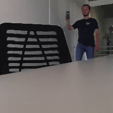

# Autonomous Drone Delivery
*[Currently under development]*

## Motivation
The importance of delivering cargos, food, letters, etc. has been increasing recently. Currently, there are projects that enable the delivery of goods to  the backyard of the house using drones.  However, this project aims to create a more universal delivery system. The solution being developed will be able to be used both for delivery to multi-storey apartment buildings and to customers in the open air.

N.B. At the moment, we are leaving security and legal issues aside.

## Work description

### Let's look at an example of delivery of goods to a client in an apartment building.

1. Client makes an order in the application.
2. The order + technical information + GPS coordinates are sent to the delivery company's server. The cargo and the customer are assigned one unique identifier (for simplicity: "AAA" code).
3. When an order is formed, it is loaded into a container which is attached to the drone.
4. The drone flies from the issuing point to the client's coordinates.
5. When the drone arrives, 2 things happen:
    1. The client's phone is notified that the drone has arrived. The flashlight on the phone starts flashing, sending the ID (for simplicity, Morse code message "AAA" [.- .- .-]).
    2. The drone hangs in the air and starts looking for flashing objects. If it finds a flashing dot in the image, it checks the code of its cargo ("AAA") against the code it 'sees' in the image.
6. If the codes do not match, the drone keeps looking for flashing objects around it. If the codes match, the drone flies to client's window at a safe distance, the client opens the window and picks up the shipment.
7. If the drone delivers the shipment successfully or if it does not find the desired client within the specified time, the drone returns back to the base.  

###Scheme of interactions

## Flashlight tracking
### Data

One of the most important parts of the project is finding and recognising the torch signal.
The drone we use transmits a picture of 1920 x 1080, 24 fps. The frame must then be cropped and resized to 224x224.

In the table below you can see examples of data.

binarized  | resized (standard) | resized (taking max pixel) | target position
------------- | ------------- | ------------- | -------------
 |   |  | 
 |   |  | 
 |   |  | 
 |   |  | 

### Network
The current version of the neural network looks like this. 
We use MSE as a loss function.

## Old version

Our old implementation may be found in this [repo](https://github.com/SoloninMichael/super-drone-2016).

Indoor flight example videos (old implementation) may be found [here](https://youtu.be/fwbexNxMMMk) and [here](https://youtu.be/_pC00CkuSbY)

